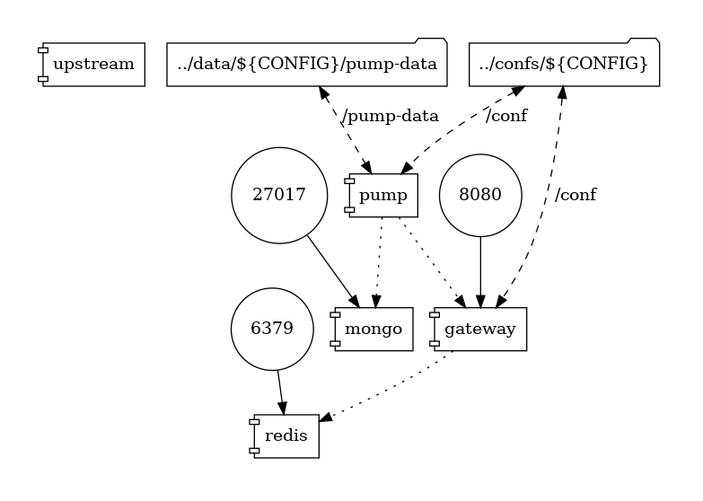
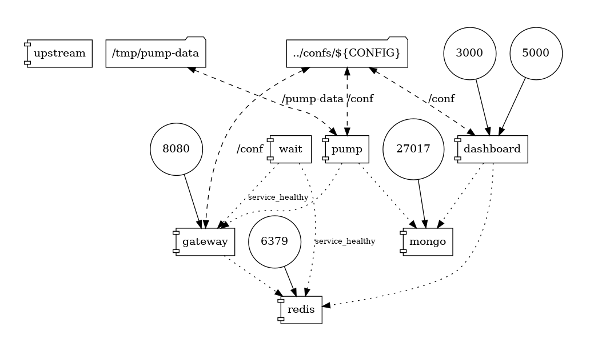
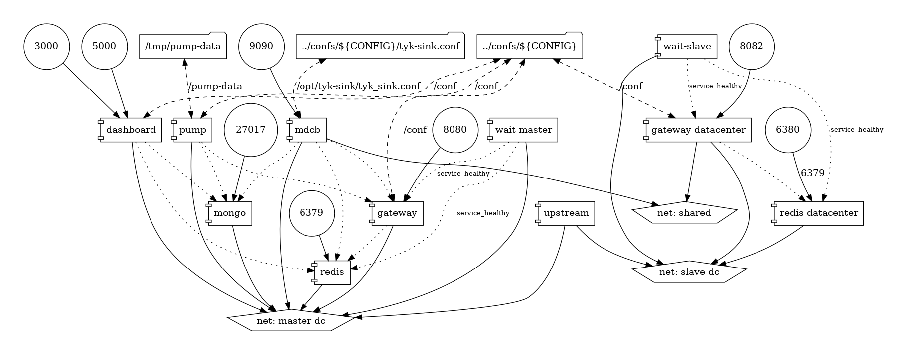

# System Testing

This repo is meant to host the system testing infrastructure and code. Within each repo there are CI tests which are meant to quickly give feedback on PRs. In this repo, we explore higher abstractions of testing, including but not limited to,
- interaction between various component versions
- multi-architecture support (phase 2, not implemented)
- performance benchmarks (phase 3, not implemented)

# Testing using tyk-automated-tests

Tyk can be deployment in many ways. A deployment is modelled by a compose file. `pro.yml` models a standard Tyk Pro installation.

## Directory structure
```
auto
├── tat.env            # configurations required for tyk-automated-tests
├── bundle_server -> ../compose/tyk-components/bundle_server
├── deps.yml           # dependencies that can be reused between deployment models
├── master.env         # versions of the Tyk components
├── pro/               # Tyk config that is independent of where the deployment is running
├── pro.yml            # compose file defining the Tyk components in a Pro deployment
├── tyk-analytics.env  # Tyk config that depends on where the deployment is running
├── tyk.env
├── tyk-pump.env
└── tyk-sink.env
```

The configuration for the tyk components are provided via config files and env variables. The distinction between the two modes of supplying configuration is that config parameters that are dependent on the deployment env are in the env file while all other config is in the config file.

# Running tests locally
## Pre-requisites
- docker compose plugin or above (not docker-compose)
- AWS integration account credentials
- dashboard license (in tyk-analytics.env files)
- mdcb license (fill in tyk-sink.env files)

## How to login to AWS ECR
You need an access token and a functional AWS CLI with the sub-account to publish, install, and delete packages in AWS ECR. There is [a note in OneLogin](https://tyk.onelogin.com/notes/108502) with the AWS credentials which have just enough privileges to push and pull from the registry as well as access to logs. Once you have the CLI functional, you can login with:
``` shellsession
% aws ecr get-login-password --region eu-central-1 | docker login --username AWS --password-stdin 754489498669.dkr.ecr.eu-central-1.amazonaws.com
```

## Bring up an env
This will bring up a Pro installation using the `master` branch for all components. It does not _build_ the images but relies on `release.yml` in the repo having already pushed the images to ECR. 
``` shellsession
$ cd auto
# define an alias for later
# confs_dir points to the root of the config dir
$ alias master="confs_dir=./pro docker compose -f pro.yml -f deps.yml -p master --env-file master.env --env-file=tat.env"
$ master up -d
```

## Run tests
In the `tyk-automated-tests` repo,
``` shellsession
$ pytest -c pytest_ci.ini [dir or file]
```

# Example environments

## OSS: GW + PUMP + REDIS + MONGO



## PRO: GW + PUMP + DASH + REDIS + MONGO



## PROHA: GW + PUMP + DASH + REDIS + MONGO + MDCB + GW-SLAVE + REDIS-SLAVE


# How to execute (WIP can change)
## PRO
```
# dashboard & gw test
make -f Makefile.pro pro
# clean
make -f Makefile.pro clean
```

# Test Explanation (do not read)
- OSS
	- gw:
		- Add keyless api definition into /app folder 
		- Query the endpoint
	- pump:
		- CSV TEST:
		  - set up two diferent pumps filters for two orgs (st and stmongo)
				- csv pump = st org
				- mongo pump = stmongo org
			- Add an auth enabled API to the gw by using API
			- Upload the key for that secured API
			- Query the API using a custom agent as header
			- Look for CSV file on pump data folder, grep the CSV in order to search for header presence (OK)
		- MONGO TEST:
			- Repeat above steps but now export the analytics for the stmongo org which will go to mongo.
			- Dump mongo db and grep over the dump to search for custom header presence (OK)
- PRO
	- dashboard & gw:
		- Create a org in dashboard
		- Create a user
		- Reset user password
		- Create a keyless API
		- Query new API
- PROHA
	- dashboard & gw & mdcb & gwslave:
		- Create a org in dashboard with hybrid enabled
		- Create a user
		- Reset user password
		- Create a keyless API
		- Spin slave datacente (gw & redis)
		- Set RPC & APIKEY for GW slave
		- Query new API from gw master
		- Query new API from gw slave


